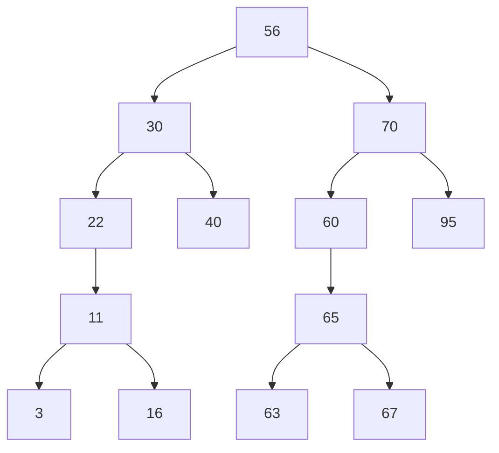
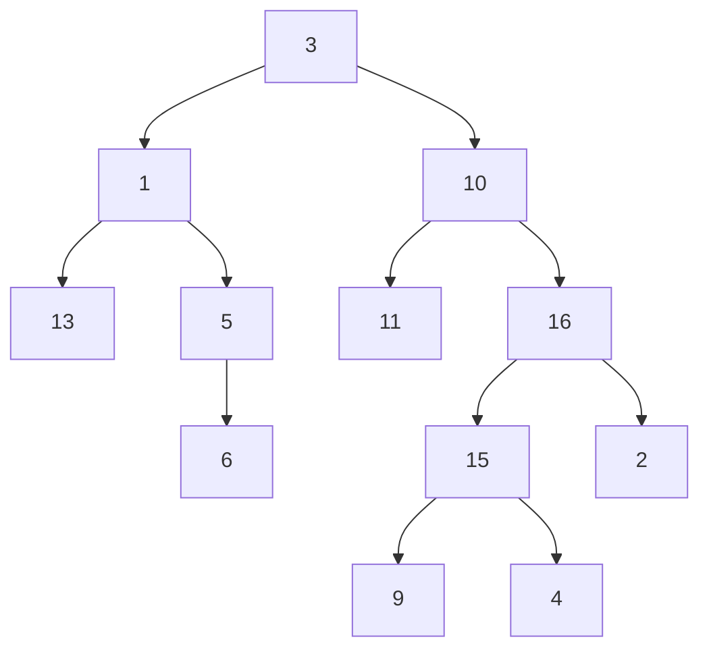
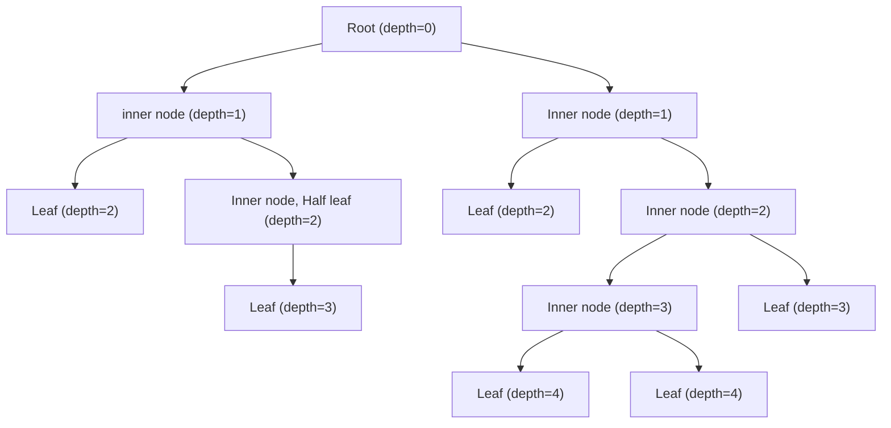

# java-examples

## About

Repository containing various Java examples, including:

- Concurrency, threading, and synchronization
- Different approaches to work with database
- Functional programming
- Design patterns

## Table of Contents

1. [Concurrency](#concurrency)
   1. [Memory](#memory)
   2. [Synchronization](#synchronization)
   3. [Threads](#threads)
   4. [Virtual Threads](#virtual-threads)
2. [Database](#database)
   1. [JDBC](#jdbc)
   2. [Spring Data JPA](#spring-data-jpa)
   3. [Spring Data JDBC](#spring-data-jdbc)
3. [Functional Programming](#functional-programming)
   1. [Filtering Iterator](#filtering-iterator)
   2. [Stream API](#stream-api)
4. [Data Structures](#data-structures)
   1. [Binary Tree](#binary-tree)
5. [Contact](#contact)

## Concurrency

### Memory

### Synchronization

### Threads

### Virtual Threads

## Database

### JDBC

### Spring Data JPA

### Spring Data JDBC

### Functional Programming

#### Filtering Iterator

#### Stream API

##### mapMulti()

`mapMulti()` is a new Stream API intermediate operation, available since JDK 16. It is represented by the following
`default` method in the Stream interface:

```java
default <R> Stream<R> mapMulti(BiConsumer<? super T, ? super Consumer<R>> mapper)
```

The `mapMulti()` can be used to replace the combination of `filter()` and `map()` intermediate operations. It gets an
input stream of elements and outputs another stream containing zero, less, the same, or larger number of elements that
can be unchanged or replaced by other elements. This means that each element from the input stream can pass through a
`one-to-zero`, `one-to-one`, or `ont-to-many` mapping.

The `mapMulti()` intermediate operation is useful when we have to replace only few elements from the stream. This is
formulated in the official documentation as follows:

> When replacing each element with a small (possibly zero) number of elements. Using this method avoids the overhead of
> creating a new Stream instance for every group of result elements, as required by **flatMap**.

The `mapMulti()` is also useful when the imperative approach is preferable against the stream approach. This statement
is formulated in the official documentation as follows:

> When it is easier to use an imperative approach for generating result elements than it is to return them in the form
> of a **Stream**.

## Data Structures

### Binary Tree

#### Binary Tree example

An example of binary tree might look like this:



Or something like this:



#### Binary Tree Terminology

- A **node** is a structure that contains data and optional reference to a left and a right **child node** (aka. **child**).
- An **edge** is a connection between two nodes.
- The very top node is called the **root** or **root node**.
- A node that has children is called **inner node** (short: **inode**). It is also the **parent node** of it's child(ren).
- A node with no children is called **outer node** or **leaf node** or just a **leaf**.
- _In binary trees only a node with only one child is called **half node**.)_
- The number of child nodes is called the **degree** of a node.
- The **depth** of a node means how many levels the node is away from the root (_the root has a depth of 0, the root's
  children have a depth of 1, etc._)
- The **heigh** of a binary three is the maximum depth of all its nodes.

Below is the binary tree labeled with node types.



## Contact

You can reach me at [github.com/kuszyp](https://github.com/kuszyp) or mail me at [github[at]myapp.pl](mailto:github@myapp.pl).
